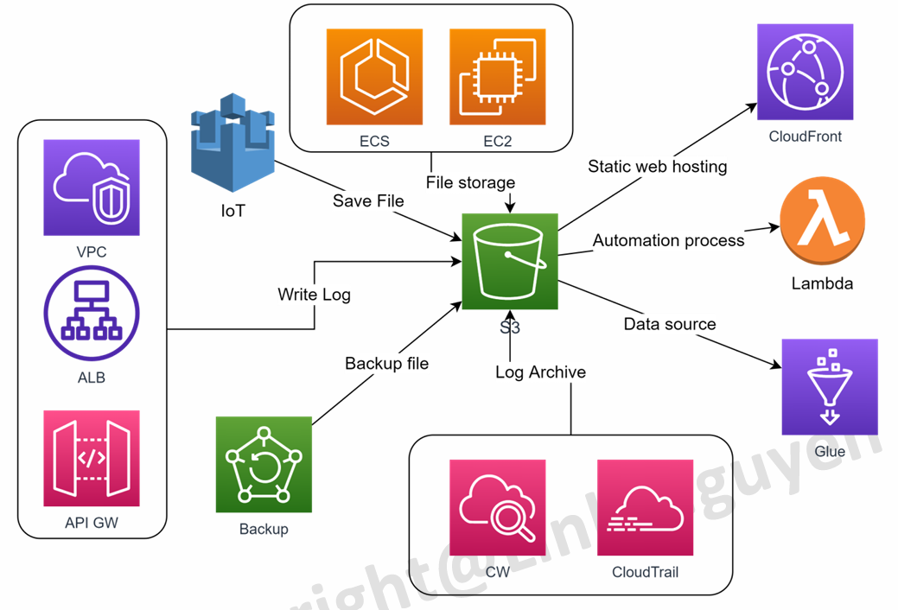

# AWS Cloud for beginner (Vietnamese)

Đây là repo cho khóa học về AWS cơ bản trên Udemy.

## Mục lục

- [Section 07 - EC2](#section-07)
- [Section 08 - IAM](#section-08)
- [Section 09 - S3](#section-09)
- [Section 10 - ELB & ASG](#section-10)

## Fundamental

<details>
<summary><strong>HTTP & HTTPS</strong></summary>

- Nếu không chỉ định port trong URL, trình duyệt sẽ sử dụng port mặc định của giao thức: 80 cho HTTP và 443 cho HTTPS.

</details>

## Section 07 

<p align="center">
    EC2 - Computing
</p>

<details>
<summary></summary>
<!-- Thêm nội dung vào sau dòng này -->


- **EC2** là một service cung cấp tài nguyên server ảo theo nhu cầu.
    - Đa dạng cấu hình, dễ dàng triển khai.
    - Khả năng mở rộng gần như không giới hạn.
    - là một máy chủ ảo chạy trên Hypervisor (Trình ảo hóa) của AWS, bên dưới là các phần cứng.

- **Một số khái niệm cơ bản**
    - AMI (Amazon Machine Image): Giống như 1 file ISO/Ghost chứa toàn bộ thông tin của hệ điều hành. EC2 được khởi động lên từ 1 AMI tương tự như việc cài Win lần đầu cho PC/Laptop. Muốn khởi động một EC2 bắt buộc phải có AMI.
    - EBS Volume: Ổ cứng ảo được cấp phát bởi Amazon. Chỉ có thể đọc được dữ liệu khi được gắn vào 1 Instance.
    - Snapshot: Ảnh chụp của 1 EBS Volume tại 1 thời điểm. Có thể sử dụng để phục hồi dữ liệu khi có sự cố.

    <p align="center">
        
    </p>

- **Vòng đời của EC2 Instance**
    - EC2 Default
        - Lưu ý: EC2 ở trạng thái Terminated không thể phục hồi lại được. Ổ cứng EBS gắn với instance tùy setting mà sẽ bị xóa hay không.

        <p align="center">
            
        </p>

    - EC2 using instance-store volume
        - Loại EC2 này gắn trực tiếp trn máy host, sẽ mất dữ liệu khi instance stop nhưng IOPS rất cao. Phù hợp lưu trữ data không quan trọng hoặc data caching đòi hỏi tốc độ đọc ghi cao. 
        - Instance loại này sẽ **không thể stop tạm thời** mà chỉ có thể launch, reboot, terminate.

        <p align="center">
            
        </p>

- **Security Group**: để giới hạn truy cập tới EC2 và từ EC2 ra bên ngoài.
    - Rule của security group là stateful, request đến sẽ tự nhận được response mà không phải định nghĩa 1 cách tường minh cho phép đi ra.
    - Default nếu không có yêu cầu gì đặc biệt thì Outbound (từ trong đi ra) sẽ mở all.
    - Rule của Security Group chỉ có Allow không có Deny.
    - Một EC2 có thể gắn nhiều hơn 1 Security Groups.
    - Ngắn gọn: Inbound - Từ đâu được gọi đến đây, Outbound - Từ đây gọi được đến đâu.

    <p align="center">
        
    </p>

- **Thao tác với máy ảo**
    - File **`.pem`** phải được giữ, sẽ được tải xuống vào lần đầu tiên tạo **Key Pair**.
    - Khi muốn thao tác, nhấn nút **Connect** trên dashboard EC2 và thực hiện các thao tác cần thiết để truy cập
        <p align="center">
            
        </p>
    - Dùng lệnh **`logoff`** trong **Search** để thoát đối với máy ảo Window.


- **EBS**
    - Đặc trưng
        - Là một cơ chế lưu trữ dạng block.
        - Đơn vị quản lý là các EBS Volume.
        - Chỉ có thể access data khi được gắn vào 1 EC2 instance (dùng làm ổ root, C: hoặc ổ data)
        - Một số loại EBS đặc biệt cho phép gắn vào nhiều hơn 1 EC2 instance (multi attach).
        - Có thể tăng size một cách dễ dàng ngay cả khi server đang chạy (lưu ý: không thể giảm size).
    - Tính tiền
        - Dung lượng của volume ($/GB/Month), không xài hết cũng mất tiền 100% trên dung lượng vì đã cấp phát rồi.
        - IOPS: Tốc độ đọc ghi càng cao, càng phát sinh phí.
        - Dung lượng của các bản snapshot của ổ cứng ($/GB/Month) tuy nhiên giá rẻ hơn lưu trữ.


    - *Ví dụ*: **`/dev/xvda1`** là partition số 1 được gắn vào instance **`/dev/xvda`**. 
        - Partion số 1 thường là root, có thể lưu data khác vào partion số 2,....

- **User-Data, Meta-Data**
    - EC2 cung cấp một cơ chế cho phép chạy script tại thời điểm launch gọi là user data
        Có thể sử dụng user data để thực thi một số hành động
        - Install software
        - Download source code/artifact
        - Customize settings

        **Lưu ý:** 
        - Không nên để các thông tin nhạy cảm như DB username/pw vào trong user data.
        - Mỗi EC2 có một bộ thông tin được nạp lên sau khi khở động gọi là meta data. Thông tin bao gồm địa chỉ IP public/private, security group, AMI-ID, Role,... phục vụ truy xuất khi cần thiết.
        - Meta data được lưu tại địa chỉ: http://169.254.169.254/latest/meta-data (cố định cho cả windows và linux)

- **Các usecase cơ bản của EC2**
    - Là nền tảng cơ bản của các dịch vụ Container như ECS và EKS.
    - Lift and shift: Migrate 1:1 các ứng dụng đang chạy trên On-premise của cty, không có nhu cầu tái cấu trúc.
    - Chạy các website cơ bản all in one.
    - Compute cluster: dùng cho các ứng dụng chạy xử lý data như Hadoop, Spark,…
    - Dùng làm database trong trường hợp không muốn xài dịch vụ database sẵn của AWS.
    - Dùng làm node của cluster K8S.

<!-- Thêm nội dung vào trước dòng này -->
</details>


## Section 08

<p align="center">
    Identity and Access Managment (IAM)
</p>

<details>
<summary></summary>
<!-- Thêm nội dung vào sau dòng này -->

- **Policy**
    - Quy định việc ai/cái gì có thể hoặc không thể làm gì.
    - Một policy thường bao gồm nhiều Statement quy định Allow/Deny hành động trên resource dựa trên condition.
        Mỗi statement cần định nghĩa các thông tin:
        - Effect: có 2 loại là Allow & Deny; Deny được ưu tiên hơn.
        - Action: tập hợp các action cho phép thực thi.
        - Resource: tập hợp các resource cho phép tương tác.
        - [Condition]: Điều kiện kèm theo để apply statement này.
    - Policy có thể gắn vào Role/Group/User.
    - Policy có 2 loại là: Inline Policy và Managed Policy
        - Inline policy: được đính trực tiếp lên Role/User/Group và 
        không thể tái sử dụng ở Role/User/Group khác.
        - Managed Policy: Được tạo riêng và có thể gắn vào nhiều 
        User/Group/Role.
            - Managed Policy lại được chia thành 2 loại là AWS Managed và User Managed.
            - Việc lựa chọn giữa Inline vs Managed phải được tính toán 
            dựa trên các yếu tố như: tính tái sử dụng, quản lý thay đổi 
            tập trung, versioning & rollback.

    - Ví dụ:

        ```json
        {   
            "Version": "2012-10-17",
            "Statement": [
                {
                    "Effect": "Allow",
                    "Action": [
                        "ec2:StartInstance",
                        "ec2:StopInstance"
                    ],
                    "Resource": "arn:aws:ec2:*:*:instance/*",
                    "Condition": {
                        "StringEquals": {
                            "aws:ResourceTag/Environment": "Dev"
                        }
                    }
                }
            ]
        }
        ```
        Policy này quy định đối tượng được gán policy này 
        được phép thực hiện 2 hành động là StartInstance và 
        StopInstance trên toàn bộ các EC2 instance với điều 
        kiện instance đó có 1 thẻ tag tên Environment và giá 
        trị = Dev.

- **User**
    - Đại diện cho 1 profile của 1 người dùng trên AWS account.
    - User có thể login vào AWS Console sử dụng username/password.
    - User mặc định khi tạo ra sẽ không có quyền gì. Cần cấp quyền cho user thông qua Policy hoặc Group.
    - User có thể phát hành access-key/secret-key để sử dụng cho CLI hoặc test SDK trong quá trình test code. Cặp access/secret key này cũng sẽ đại diện cho user (thay vì dùng username/password).

- **Role**
    Sử dụng khi muốn cấp quyền cho 1 thực thể có thể tương tác với các resources khác trên AWS. Thường dùng để gắn vào EC2, Lambda, Container,...

    **Lưu ý**: một resource trên AWS không thể tương tác với resource khác nếu không được gán Role với các quyền thích hợp. Đây cũng chính là lý do khiến cho việc Role & Permission khiến cho mọi người tốn thời gian trouble shooting nếu không nắm rõ dịch vụ mà mình đang sử dụng.

- Group
    - Đại diện cho 1 nhóm user trên hệ thống.
    - Sử dụng khi  muốn phân chia quyền dựa theo vai trò trong dự án, phòng ban,...

        Nên thiết kế các nhóm user và phân quyền hợp lý, sau đó khi có người mới chúng ta chỉ cần add user đó vào các nhóm cần thiết giúp tiết kiệm thời gian và tránh sai sót (cấp dư hoặc thiếu quyền).


<!-- Thêm nội dung vào trước dòng này -->
</details> 


## Section 09

<p align="center">
    Simple Storage Service (S3)
</p>

<details>
<summary></summary>
<!-- Thêm nội dung vào sau dòng này -->

- Là một dịch vụ lưu trữ dạng Object cung cấp khả năng mở rộng availability, performance.

    - Là một Managed Service cho phép lưu file dưới dạng object với size từ 0 - 5TB.
    - High Durability (11 9s), Scalability, High Availability (99.99%), High performance.
    - Cung cấp nhiều class lưu trữ để tiết kiệm chi phí cho từng loại data, khả năng phân quyền và giới hạn truy cập một cách chi tiết.
    - Usecase đa dạng (mọi bài toán về lưu trữ từ lớn tới nhỏ đều có thể sd S3).

- **Các tính năng cơ bản**

    - **Storage classes**:      cung cấp nhiều hình thức lưu trữ phù hợp cho nhiều loại data khác nhau về nhu cầu access, durability,...
    - **Storage management**:   Cung cấp nhiều tính năng liên quan quản lý như: Life Cycle, Object Lock, Replication, Batch Operation.
    - **Access Management**:    quản lý truy cập đến bucket và các thư mục thông qua cơ chế resource permission & access list. 
    - **Data processing**:      kết hợp với lambda, SNS, SQS để hỗ trợ xử lý data 1 cách nhanh chóng.
    - **Strong consistency**:   Provice strong read-after-write consistency for PUT and DELETE object.
    - **Monitoring**
        - Auto Logging and Monitoring: cung cấp công cụ monitor S3 bucket và truy vết sử dụng CloudTrail.
        - Manual Monitoring Tool: Log lại từng record thực hiện trên bucket.
        - Analytic and insight: phân tích storage để optimize.

- **Kết hợp dịch vụ khác với S3**

    <p align="center">
        
    </p>

    <details>
    <summary></summary>

    - Dùng làm nơi **lưu trữ file** cho các ứng dụng chạy trên EC2, Container, Lambda. Các file có thể đa dạng về loại & kích thước (Image,Video, Document,...).
    - Dùng làm nơi **chứa/archive log** cho hầu hết các dịch vụ khác của AWS (VPC, ALB, APIGateway,...).
    - Dùng làm **data source** cho các bài toán big data & data warehouse.
    - Nơi lưu dữ liệu gửi lên từ các thiết bị IoT.
    - Vùng **lưu trữ tạm thời cho bài toán ETL** (Extract – Transform - Load) khi kết hợp với Lambda.
    - **Host 1 website tĩnh** (html,css,js) khi kết hợp với CloudFront.
    </details>

- **S3 Storage Class**

    - S3 cung cấp nhiều storage class khác nhau nhằm giúp người dùng linh động trong việc lựa chọn class  phù hợp với nhu cầu, tiết kiệm chi phí.
        
        Việc lựa chọn class phụ thuộc vào các yếu tố như:
        - Durability, High Availability
        - Thời gian lưu trữ (1 tháng, 1 năm, 5 năm...)
        - Tần suất truy cập, thời gian cần có file khi có yêu cầu
        - Mục đích sử dụng: document, image, log file, backup file, archive

    - Phân biệt cc S3 Storage Class
        | Lớp lưu trữ | Mục đích sử dụng | Giá | Thời gian truy xuất | Minimum storage duration | Phù hợp với |
        |-----------|----------------|-----|---------------------|---------------------------|-----------|
        | S3 Standard | Dữ liệu truy cập thường xuyên | Cao | Ngay lập tức | Không có | Web assets, user uploads, model ML |
        | S3 Intelligent-Tiering | Tự động chuyển tier dựa trên mức độ truy cập | Trung bình | Ngay lập tức (sau khi chuyển tier) | Không có | Dữ liệu có pattern truy cập không ổn định |
        | S3 Standard-IA | Ít truy cập nhưng cần truy xuất nhanh | Thấp | Ngay lập tức | 30 ngày | Backup, logs, dữ liệu ít đọc |
        | S3 One Zone-IA | Giống Standard-IA nhưng chỉ 1 Availability Zone (rẻ hơn, ít bền hơn) | Rất thấp | Ngay lập tức | 30 ngày | Dữ liệu không quan trọng, có thể tái tạo |
        | S3 Glacier | Archive, dữ liệu rất lạnh | Rất thấp | Vài giờ (phải restore) | 90 ngày | Compliance, backup dài hạn |
        | S3 on Outposts | S3 chạy trên hạ tầng AWS Outposts (on-prem) | Tùy cấu hình Outposts | Latency nội bộ | Không có | Hybrid workload cần lưu trữ tại data center riêng |

        Lưu ý:
        - Minimum storage duration trong Amazon S3 nghĩa là: AWS yêu cầu bạn trả tiền tối thiểu cho một khoảng thời gian, dù bạn xóa object sớm hơn.

- **S3 Lyfe Cycle**
    - Tính năng cho phép tự động move object xuống các class lưu trữ thấp hơn hoặc xoá luôn sau một khoảng thời gian nhằm tiết kiệm chi phí.
    - Khác với Intelligent Tiering, người dùng sẽ tự quyết định life cycle cho objects (hoặc 1 thư mục), vd sau 90 ngày thì cho xuống Glacier, sau 270 ngày thì xoá hoàn toàn.
    - Phù hợp cho các bài toán lưu trữ Log đã biết trước thời gian thường xuyên access và thời gian có thể xoá.

- **S3 event trigger**
    - S3 cung cấp cơ chế trigger 1 event sang dịch vụ khác khi có thay đổi đối với object (upload, delete).
    - Target của trigger có thể là Lambda Function, SNS, SQS.
    - Sample usecase
        - Resize image khi có người upload image lên s3 bucket, lưu vào các thư mục size khác nhau
        - Giải nén 1 file zip khi có người upload.
        - Extract csv file, xử lý data rồi lưu vào database
        - Notification tới Operator khi có ai xoá 1 file

- **Best practices**
    - Chọn region của S3 cùng region với application (EC2, ECS) để tối ưu performance.
    - Sử dụng bucket policy cho những data quan trọng. Cấp quyền vừa đủ cho user/role, hạn chế cấp S3FullAccess.
    - Bật versioning để bảo vệ data tránh bị mất, xoá nhầm.
    - Mã hoá data nhạy cảm (client side or server side).
    - Enforce TLS để yêu cầu sd HTTPS khi truyền nhận file (chống hack).
    - Sử dụng VPC endpoint để tăng tốc truy cập từ application (sẽ học ở bài VPC).
    - Khi host static web, nên kết hợp với CloudFront để tối ưu chi phí và tăng trải nghiệm người dùng.

<!-- Thêm nội dung vào trước dòng này -->
</details>


## Section 10

<p align="center">
    Load Balancing và Autoscaling
</p>

<details>
<summary></summary>
<!-- Thêm nội dung vào sau dòng này -->


<!-- Thêm nội dung vào trước dòng này -->
</details>