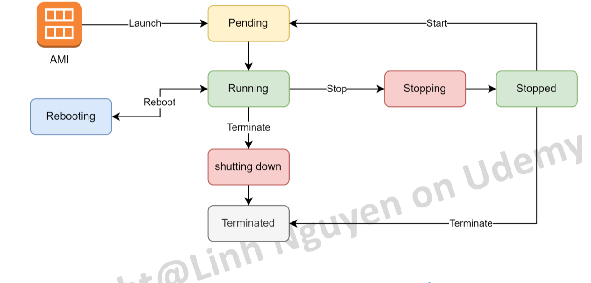

# AWS Cloud for beginner (Vietnamese)

Đây là repo cho khóa học về AWS cơ bản trên Udemy.

## Mục lục

- [Section 07 - EC2](#section-07)
- [Section 08 - IAM](#section-08)
- [Section 09 - S3](#section-09)
- [Section 10 - ELB & ASG](#section-10)

## Fundamental

<strong>HTTP & HTTPS</strong>

- Nếu không chỉ định port trong URL, trình duyệt sẽ sử dụng port mặc định của giao thức: 80 cho HTTP và 443 cho HTTPS.

## Section 07 

    EC2 - Computing

<!-- Thêm nội dung vào sau dòng này -->

- EC2 là một service cung cấp tài nguyên server ảo theo nhu cầu.
    - Đa dạng cấu hình, dễ dàng triển khai.
    - Khả năng mở rộng gần như không giới hạn.
    - là một máy chủ ảo chạy trên Hypervisor (Trình ảo hóa) của AWS, bên dưới là các phần cứng.

- Một số khái niệm cơ bản
    - AMI (Amazon Machine Image): Giống như 1 file ISO/Ghost chứa toàn bộ thông tin của hệ điều hành. EC2 được khởi động lên từ 1 AMI tương tự như việc cài Win lần đầu cho PC/Laptop. Muốn khởi động một EC2 bắt buộc phải có AMI.
    - EBS Volume: Ổ cứng ảo được cấp phát bởi Amazon. Chỉ có thể đọc được dữ liệu khi được gắn vào 1 Instance.
    - Snapshot: Ảnh chụp của 1 EBS Volume tại 1 thời điểm. Có thể sử dụng để phục hồi dữ liệu khi có sự cố.

    

        
    

- Vòng đời của EC2 Instance:
    - EC2 Default
        - Lưu ý: EC2 ở trạng thái Terminated không thể phục hồi lại được. Ổ cứng EBS gắn với instance tùy setting mà sẽ bị xóa hay không.

        

            
        

    - EC2 using instance-store volume
        - Loại EC2 này gắn trực tiếp trn máy host, sẽ mất dữ liệu khi instance stop nhưng IOPS rất cao. Phù hợp lưu trữ data không quan trọng hoặc data caching đòi hỏi tốc độ đọc ghi cao. 
        - Instance loại này sẽ **không thể stop tạm thời** mà chỉ có thể launch, reboot, terminate.

        

            
        

- Security Group: để giới hạn truy cập tới EC2 và từ EC2 ra bên ngoài.
    - Rule của security group là stateful, request đến sẽ tự nhận được response mà không phải định nghĩa 1 cách tường minh cho phép đi ra.
    - Default nếu không có yêu cầu gì đặc biệt thì Outbound (từ trong đi ra) sẽ mở all.
    - Rule của Security Group chỉ có Allow không có Deny.
    - Một EC2 có thể gắn nhiều hơn 1 Security Groups.
    - Ngắn gọn: Inbound - Từ đâu được gọi đến đây, Outbound - Từ đây gọi được đến đâu.

    

        
    

- Thao tác với máy ảo
    - File **`.pem`** phải được giữ, sẽ được tải xuống vào lần đầu tiên tạo **Key Pair**.
    - Khi muốn thao tác, nhấn nút **Connect** trên dashboard EC2 và thực hiện các thao tác cần thiết để truy cập
        

            
        

    - Dùng lệnh **`logoff`** trong **Search** để thoát đối với máy ảo Window.

- EBS
    - Đặc trưng
        - Là một cơ chế lưu trữ dạng block.
        - Đơn vị quản lý là các EBS Volume.
        - Chỉ có thể access data khi được gắn vào 1 EC2 instance (dùng làm ổ root, C: hoặc ổ data)
        - Một số loại EBS đặc biệt cho phép gắn vào nhiều hơn 1 EC2 instance (multi attach).
        - Có thể tăng size một cách dễ dàng ngay cả khi server đang chạy (lưu ý: không thể giảm size).
    - Tính tiền
        - Dung lượng của volume ($/GB/Month), không xài hết cũng mất tiền 100% trên dung lượng vì đã cấp phát rồi.
        - IOPS: Tốc độ đọc ghi càng cao, càng phát sinh phí.
        - Dung lượng của các bản snapshot của ổ cứng ($/GB/Month) tuy nhiên giá rẻ hơn lưu trữ.

    - *Ví dụ*: **`/dev/xvda1`** là partition số 1 được gắn vào instance **`/dev/xvda`**. 
        - Partion số 1 thường là root, có thể lưu data khác vào partion số 2,....

- User-Data, Meta-Data
    - EC2 cung cấp một cơ chế cho phép chạy script tại thời điểm launch gọi là user data
        Có thể sử dụng user data để thực thi một số hành động
        - Install software
        - Download source code/artifact
        - Customize settings

        **Lưu ý:** 
        - Không nên để các thông tin nhạy cảm như DB username/pw vào trong user data.
        - Mỗi EC2 có một bộ thông tin được nạp lên sau khi khở động gọi là meta data. Thông tin bao gồm địa chỉ IP public/private, security group, AMI-ID, Role,... phục vụ truy xuất khi cần thiết.
        - Meta data được lưu tại địa chỉ: http://169.254.169.254/latest/meta-data (cố định cho cả windows và linux)

- Các usecase cơ bản của EC2:
    - Là nền tảng cơ bản của các dịch vụ Container như ECS và EKS.
    - Lift and shift: Migrate 1:1 các ứng dụng đang chạy trên On-premise của cty, không có nhu cầu tái cấu trúc.
    - Chạy các website cơ bản all in one.
    - Compute cluster: dùng cho các ứng dụng chạy xử lý data như Hadoop, Spark,…
    - Dùng làm database trong trường hợp không muốn xài dịch vụ database sẵn của AWS.
    - Dùng làm node của cluster K8S.

<!-- Thêm nội dung vào trước dòng này -->

## Section 08

    Identity and Access Managment (IAM)

<!-- Thêm nội dung vào sau dòng này -->

<!-- Thêm nội dung vào trước dòng này -->

## Section 09

    Simple Storage Service (S3)

<!-- Thêm nội dung vào sau dòng này -->

<!-- Thêm nội dung vào trước dòng này -->

## Section 10

    Load Balancing và Autoscaling

<!-- Thêm nội dung vào sau dòng này -->

<!-- Thêm nội dung vào trước dòng này -->

