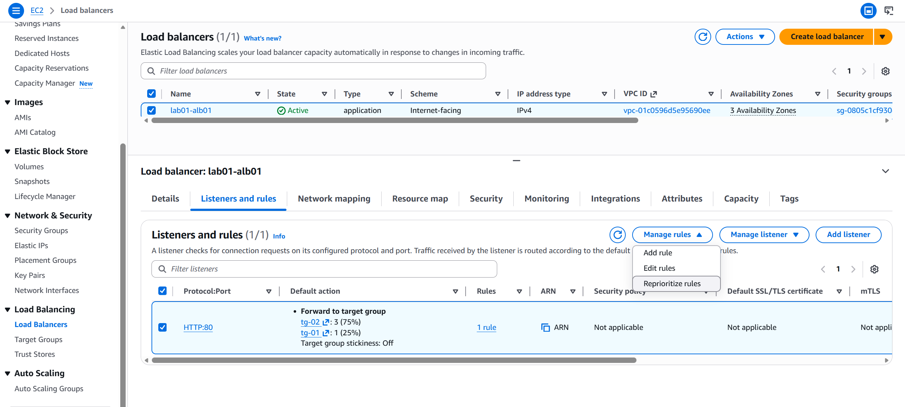
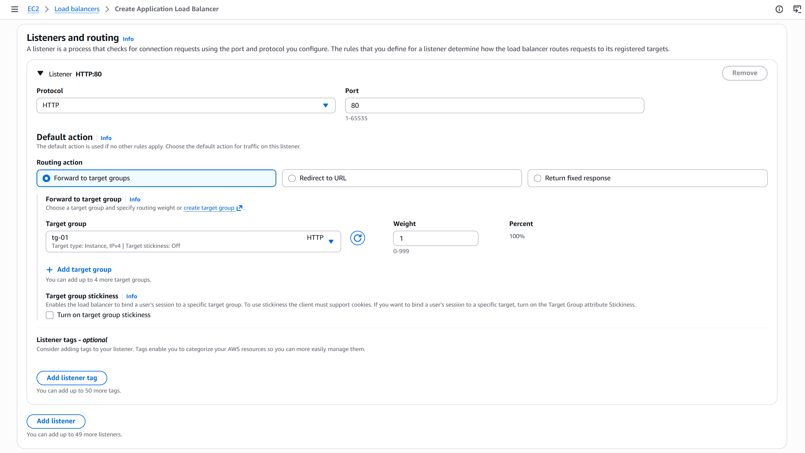

<h1 align="center">
    <strong>AWS CONSOLE</strong>
</h1>

## Mục lục

- [Elastic Load Balancer (ELB)](#elastic-load-balancer-elb)
    - [Tạo **Target Group**](#tạo-target-group)
    - [**Console** khi truy cập **ELB**](#console-khi-truy-cập-elb)
    - [Tạo **ELB**](#tạo-elb)

## Elastic Load Balancer (ELB)

### Tạo **Target Group**

&nbsp;&nbsp;

    

 

- Ghi chú:
    - Port ở đây là port đang mở <strong>của instance</strong></i>

### **Console** khi truy cập **ELB**

    
     

 

### Tạo **ELB**

    

 

- Ghi chú:
    - Port ở đây là port <strong>của ELB</strong> khi truy cập &lt;ELB_DNS&gt;:&lt;DES_PORT&gt;.

