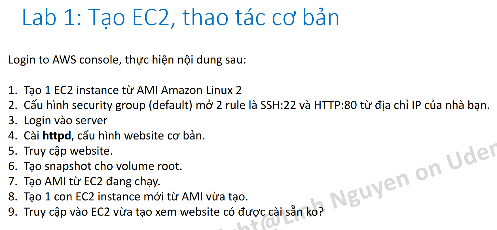
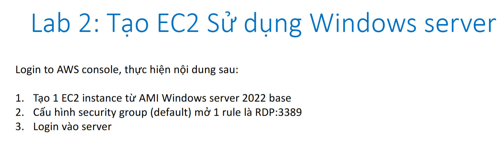
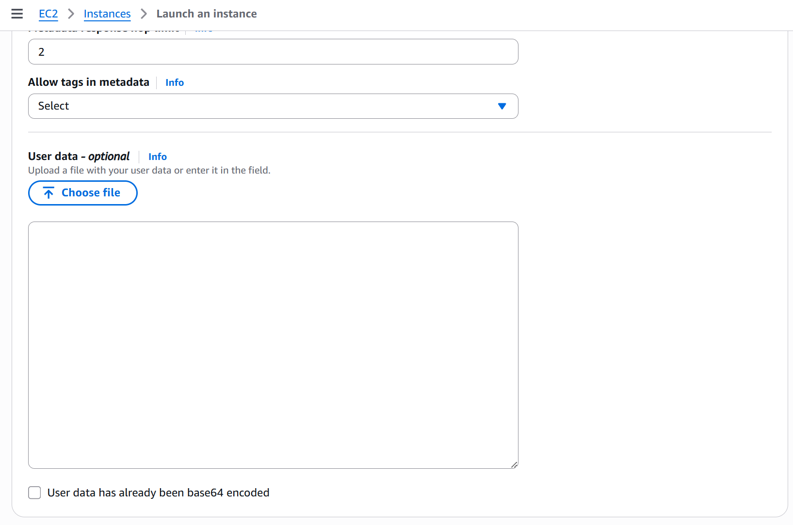
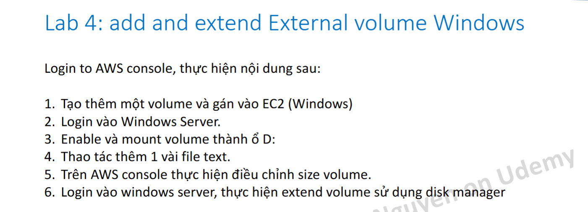

## 01

    

- **httpd** sẽ phục vụ file `/var/www/html/index.html` khi truy cập vào root URL (`/`). Nếu muốn chỉnh sửa nội dung website, cần chỉnh file này bằng quyền root.
    - Mở file bằng lệnh `sudo vi /var/www/html/index.html` hoặc `sudo nano /var/www/html/index.html`.  
    - Sau khi chỉnh sửa xong, lưu file và reload httpd bằng `sudo systemctl restart httpd`.
    - Để phục vụ thư mục khác, chỉnh `DocumentRoot` trong `/etc/httpd/conf/httpd.conf` và restart httpd.  
    - Để phục vụ file mặc định khác, chỉnh `DirectoryIndex` trong cùng file config.

## 02

    

- Truy cập vào máy ảo bằng **Remote Desktop Connection**, do đó phải thêm connect **RDP** từ **My IP** vào phần Network.

## 03

    

- Vào **Advanced details**, copy nội dung file **`lab_03/lab3-user-data-meta-data.sh`** vào **`User data`**.

    

        
    

## 04

    

